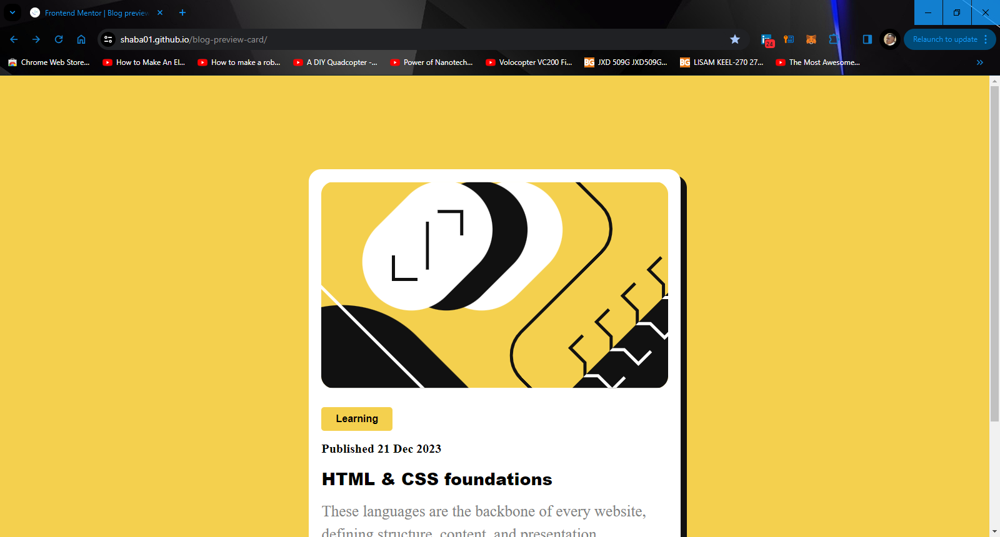
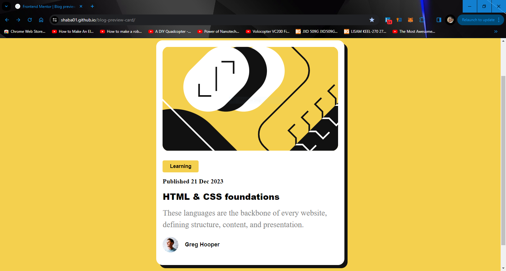
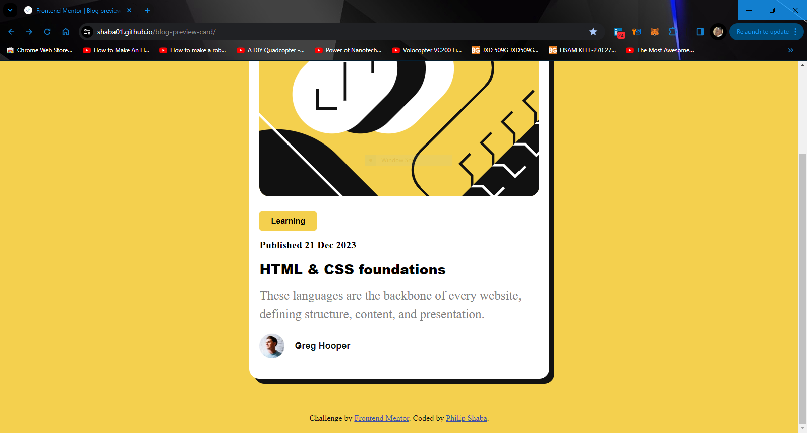
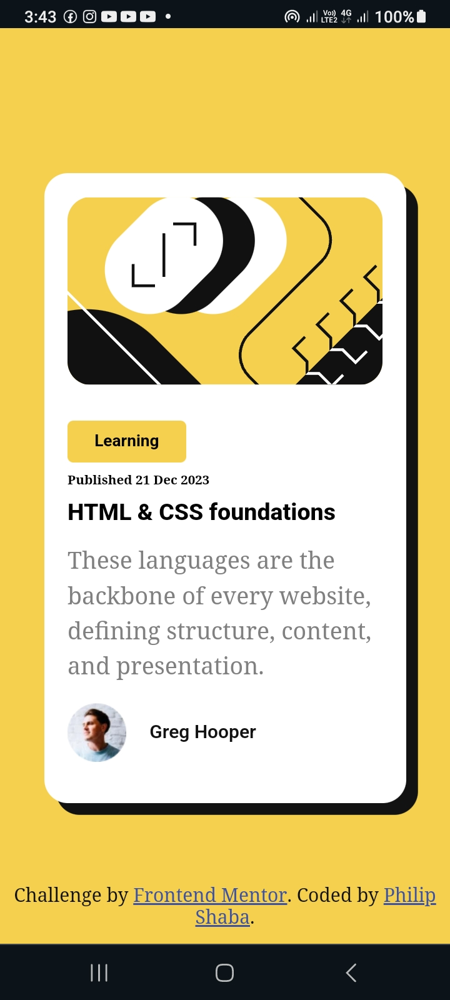

# Frontend Mentor - Blog preview card solution

This is a solution to the [Blog preview card challenge on Frontend Mentor](https://www.frontendmentor.io/challenges/blog-preview-card-ckPaj01IcS). Frontend Mentor challenges help you improve your coding skills by building realistic projects. 

## Table of contents

- [Overview](#overview)
  - [The challenge](#the-challenge)
  - [Screenshot](#screenshot)
  - [Links](#links)
- [My process](#my-process)
  - [Built with](#built-with)
  - [What I learned](#what-i-learned)
  - [Useful resources](#useful-resources)
- [Author](#author)
- [Acknowledgments](#acknowledgments)


## Overview

### The challenge

Users should be able to:

- See hover and focus states for all interactive elements on the page

### Screenshot

                                                      Desktop view







                                                      Mobile view


### Links

- [Solution URL](https://github.com/SHABA01/blog-preview-card)
- [Live Site URL](https://shaba01.github.io/blog-preview-card)

## My process

### Built with

- Semantic HTML5 markup
- CSS custom properties
- Flexbox

### What I learnt

One of the key things I learnt from this project was how to create a responsive design approach where the styles are adjusted based on the screen size using a media query for smaller screens.

For screens with a width larger than 768px (desktop screens):

```css
.blog-outer-container {
    width: 35%;
}

h1 {
    font-size: 27px;
}

h2 {
    font-size: 20px;
}

h3 {
    font-size: 16px;
}
    
h4 {
    font-size: 18px;
}

p {
    font-size: 25px;
}
```
For screens with a width less than 768px (mobile screens):

```css
@media (max-width: 767px) {
    .blog-outer-container {
        width: 70%;
    }

    h1 {
        font-size: 20px;
    }

    h2 {
        font-size: 11px;
    }

    h3 {
        font-size: 14px;
    }
    
    h4 {
        font-size: 16px;
    }

    p {
        font-size: 20px;
    }
}
```

### Useful resources

- [Mozilla Developer Network (MDN) - Responsive design](https://developer.mozilla.org/en-US/docs/Learn/CSS/CSS_layout/Responsive_Design) - MDN is a comprehensive resource provided by Mozilla that covers various aspects of web development. The section on responsive design provides detailed information about creating responsive layouts, media queries, and best practices.
- [CSS-Tricks - A Complete Guide to Flexbox](https://css-tricks.com/snippets/css/a-guide-to-flexbox) - CSS-Tricks is a popular web development community that offers practical tips and tutorials. This specific guide covers flexbox, a powerful layout mechanism in CSS. Understanding flexbox is crucial for building responsive designs, and this guide provides a comprehensive overview.

## Author

- LinkedIn - [Philip Shaba](https://www.linkedin.com/in/philip-shaba-0879a5150)
- Frontend Mentor - [@SHABA01](https://www.frontendmentor.io/profile/SHABA01)
- X - [@ShabaPhilip1](https://www.twitter.com/ShabaPhilip1)

## Acknowledgments

I would like to acknowledge the Frontend Mentor community for providing this challenge and the resources that helped me enhance my skills during this project.